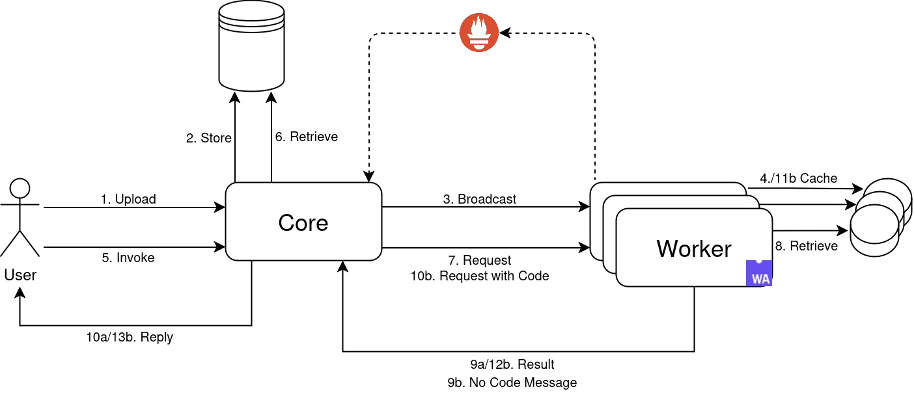
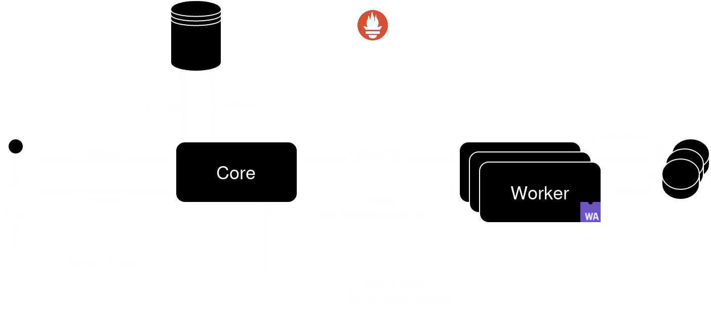

+++
title = "Overview"
description = "High-level overview of FunLess and its components."
date = 2024-05-06T08:20:00+00:00
updated = 2021-05-01T08:20:00+00:00
draft = false
weight = 1
sort_by = "weight"
template = "docs/page.html"
+++

### FunLess' skeleton

The architecture of FunLess consists of several components:

- The [Core](./../core), acting both and as the platform's entrypoint and scheduler. The Core handles all incoming HTTP requests and forwards each invocation to an available node[^1].
- The [Workers](./../worker), acting as function executors. Each Worker embeds a WebAssembly runtime and is responsible for running functions and recovering their results. Workers communicate with the Core to handle invocation requests. Moreover, each Worker holds the code for several functions in a local cache, reducing cold starts.
- A database (currently [Postgres](https://www.postgresql.org/)), holding all function information[^1]. The database is co-located on the same node as the Core, to minimise communication latency between the two[^2]. 
- A monitoring system (currently [Prometheus](https://prometheus.io/)), scraping metrics from the Workers. The Core periodically queries the monitoring system to retrieve updated information on each Worker's resource usage and status. Like the database, this component is also co-located with the Core[^2].

### Life of a request

A very simple representation of how FunLess processes requests can be seen in the following diagram:

Following the diagram, a function creation requests generally consists of four steps:

1. The user sends a request to the Core to create a function
2. The function is stored in the database
3. The Core sends the function's code to all connected Workers
4. Each Worker saves the code as-is in its local storage (whether in-memory or on a persistent medium)[^3]

An invocation requests, on the other hand, follows this path:

5. The user sends an invocation request for a function
6. The Core retrieves the function definition from the database
7. The Core selects a Worker to run the function, and forwards to it the invocation request
8. The Worker searches its cache for the function's code

9. At this point, the execution branches in two different cases:
    - 9a: The function's code is found. The Worker runs the function, and returns its result to the Core. The workflow terminates here.
    - 9b: The function's code is not found locally. The Worker sends a "no code" message to the Core

If the "b" path was taken in step 9, the request proceeds:

10. The Core sends the same request as before to the Worker, adding the function's code this time
11. The Worker caches the function's code, after a pre-compilation phase[^3] (more on that on the [Worker](../worker) description)
12. The Worker runs the function, and returns its result to the Core. The workflow terminates here.

### Note on connectivity

As of right now, FunLess relies on the [libcluster](https://github.com/bitwalker/libcluster) library to automatically connect all nodes in a single cluster, whether on top of an orchestrator or not. That being said, it is still possible to manually connect nodes to the cluster using the `Node.connect` function of the Elixir language. The nodes must be visible to each other **without NAT** to ensure the communication works[^4].

---

[^1]: At the time of writing, FunLess only supports single-Core deployments. Support for multiple cores is being worked on. In such deployments, both the database and the metric system would probably be replicated and co-located with each Core instance.

[^2]: FunLess does not currently support multi-tenancy, therefore the database only contains information about functions and modules. User information will be handled generally in the same way.

[^3]: For simplicity, the distinction between storing the code as-is and cache the pre-compiled code is not shown in the diagram. In case the pre-compiled code is not found, but the "raw" code is already in storage, the Worker simply performs the pre-compilation step and caches the result, without talking to the Core. The "raw" code is never used for function invocation, only the pre-compiled version is.

[^4]: A more thorough guide on how to configure the network and deploy FunLess without an orchestrator can be found [here](../../getting-started/bare-metal).