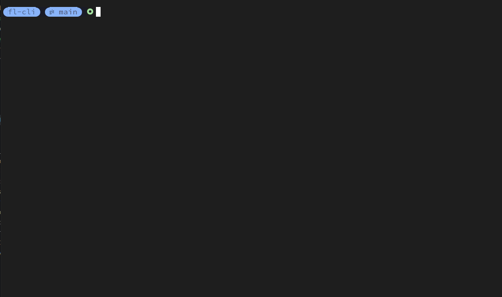
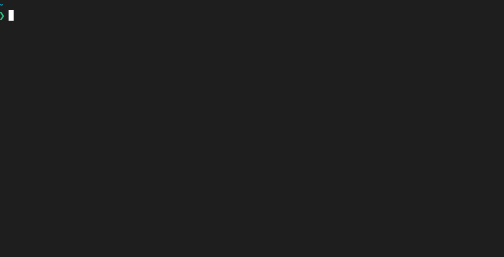

+++
title = "Quick Start"
description = "One page summary of how to start using FunLess."
date = 2021-05-01T08:20:00+00:00
updated = 2021-05-01T08:20:00+00:00
draft = false
weight = 20
sort_by = "weight"
template = "docs/page.html"

[extra]
lead = "One page summary on how to start using FunLess."
toc = true
top = false
+++

## Install the CLI

To start hacking with FunLess, all you need is the CLI tool: [fl](https://www.github.com/funlessdev/fl-cli). 

You can check out the [Releases page](https://github.com/funlessdev/fl-cli/releases) and download the most recent one based on your system
(Windows is not currently supported although there is a build for it).

Here are some quick links to download it:

- [Linux amd64](https://github.com/funlessdev/fl-cli/releases/download/v0.3.0/fl-v0.3.0-linux-amd64.tar.gz)
- [Linux arm64](https://github.com/funlessdev/fl-cli/releases/download/v0.3.0/fl-v0.3.0-linux-arm64.tar.gz)
- [Mac amd64](https://github.com/funlessdev/fl-cli/releases/download/v0.3.0/fl-v0.3.0-darwin-amd64.tar.gz)
- [Mac arm64](https://github.com/funlessdev/fl-cli/releases/download/v0.3.0/fl-v0.3.0-darwin-arm64.tar.gz)


Extract the executable from the archive and you can start using fl.


## Deploy FunLess Locally

⚠️ You need to have [Docker](https://docs.docker.com/get-docker/) installed for this! ⚠️

You can use the CLI tool to deploy the platform locally using Docker containers. 
It uses `docker compose` internally so it's a hard requirement to have a recent version of Docker.

The CLI will pull and launch 4 containers, one for the **Core** component, one for the **Worker**, one for **Prometheus** and one for **Postgres**. 
You can remove everything using the cli again.

```bash
fl admin deploy docker up
```

<!--  -->

Now that FunLess is running, you can start deploying and running functions.

## Create a function

FunLess uses [WebAssembly](https://webassembly.org/) runtimes via [Wasmtime](https://wasmtime.dev/) to run your functions.
As of now we support *Rust* and *JavaScript*, but we are working on adding more languages.

The CLI tool already handles the compiling into WebAssembly for you, so you can focus on writing your functions.

For example, let's create a new function using the `fn new` cli command. We will use Rust. From a folder of your choosing, run:

```bash
fl fn new hello_funless -l rust
``` 
<!--  -->

This will download the template folder which contains the Rust and Javascript templates, and use the Rust template
to create a new project named hello. The folder hello will contain a Cargo.toml and a lib.rs with the `fl_main` function, 
which you can fill with your code.

The template function takes a json of the form `{"name": "FunLess"}` and returns a `{"payload": "Hello FunLess"}`. You can change it to your liking.

Now you can build and deploy it to FunLess. The `create` subcommand will take care of both building and uploading.

```bash
fl fn create hello hello/ --language rust
```

The first argument of the create subcommand is the name of the function inside FunLess, the second is the path to the directory with the code. There are other commands like `build` that only builds the wasm file and saves it, `upload` that takes a wasm file and uses it to create a function in the platform. The `create` command is a combination of both, but after the function creation it deletes the wasm file so your pc stays clean. At last the `--language` is the programming language of the code.

In FunLess  each `function` is part of a `module` (you can think of them as namespaces from the C family of languages, or packages). 
Every FunLess instance has a default `_` module, so if you don't create a new module (with the `mod` subcommand) and specify it when creating functions, they will be created in the `_` module. You can get info about a module with its list of function with:

```bash
fl mod get _
```

<!--  -->

## Invoke it

Now you can invoke it. Since the function takes a json argument, you can use the `-j` flag to pass the JSON object with the 'name' key as input: 

```bash
fl fn invoke hello -j '{"name": "FunLess"}'
```

If everything worked correctly, the invocation request will be received by the core component, passed to the worker componend and the wasm
function will be executed. The result will be returned to the core component and then to the CLI, which will print it to the console.


<!--  -->


## Delete it

You can delete the function with:

```bash
fl fn delete hello 
```

## Cleaning up

When you are done, you can remove the containers and cleanup the dev deployment with:

```bash
fl admin docker deploy down
```

<!--  -->
